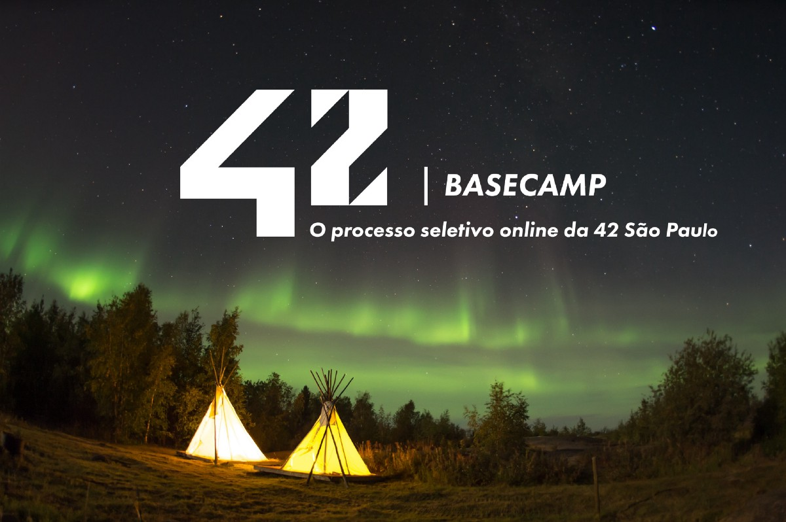

    

    
    
    

# 42_base_camp

The 42 Basecamp is a 3-week intensive course that introduces students to the fundamentals of programming. The course is designed to teach students the basics of programming, including the C programming language, the Unix operating system, and the Git version control system.

## What is 42?

42 is a non-profit organization that offers a new way of learning computer science. The school is based on peer-to-peer learning and project-based learning. Students are expected to learn by themselves and help each other. The school is free and open to everyone.

## My Experience

I completed the 42 Basecamp in 2021. I had a great experience and learned a lot. I learned how to program in C, how to use the Unix operating system, and how to use the Git version control system. I also learned how to work in a team and how to help others. I learned how to learn and how to teach. I learned how to be a better programmed.
